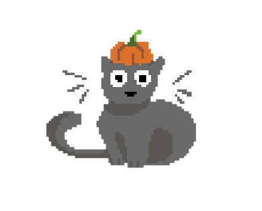

## :speech_balloon: Hi, I'm Chani! :bug:

Thanks for visiting my profile! :jack_o_lantern: 

I'm a third-year undergrad student at McGill University studying Computer Science and Physics. I am very interested in topics relating to science, programming, and game development!

- :evergreen_tree: _Interests:_ Science, Game Dev, and Digital Art (2D + 3D)
- :seedling: _Current Projects:_ my co-op puzzle game and a new project (D&D-related)
- :mushroom: _Skills:_ Java / Python, C++ / C / C# / JavaScript / Lua / Unity & Blender

Check out some of my projects below!
